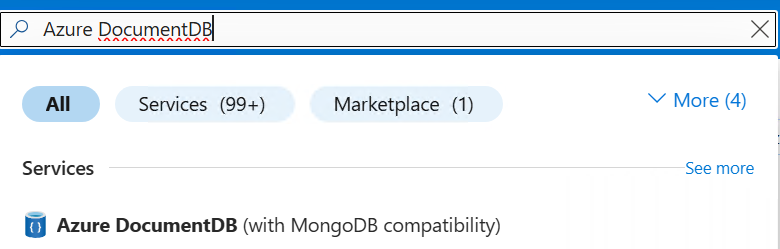
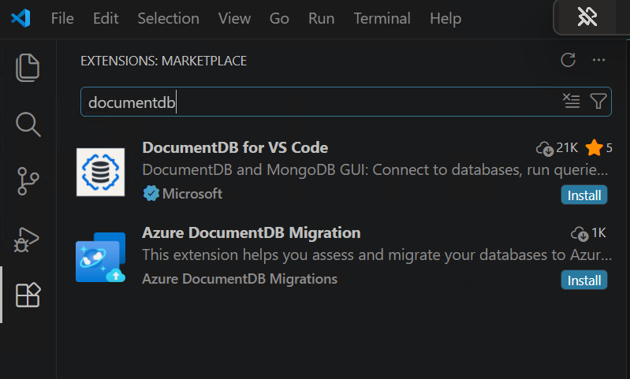

# 2. Cluster Setup and Migration

**Duration:** 2 hours

In this lab, we will cover cluster creation and migration of data from a MongoDB cluster to Azure DocumentDB.

## Learning Goals

- Provision an Azure DocumentDB cluster.
- Connect to a source MongoDB cluster and destination Azure DocumentDB from VS Code.
- Run a pre-migration assessment.
- Perform migration.
- Validate that data and application behavior are preserved.

## Prerequisites

- Azure subscription access for creating DocumentDB cluster.
- Access to the MongoDB source connection string from the instructor.
- DocumentDB for VS Code extension installed.
- Azure DocumentDB Migration extension installed.


## Part A: Create or Verify the Target Cluster

If the instructor has already provisioned a cluster, use that and continue to Part B.

If you need to create one, follow this sequence.

### Participant Cluster Setup Rules

You will create your own cluster for this lab.

Before starting, follow these workshop rules:

1. Use the naming pattern shared by your instructor, for example `docdb-lab-<name>-<nn>`.
2. Use the workshop-approved region and tier.
3. Save your cluster admin username and password in a secure place.
4. Keep your connection string private.

Self-check milestones:

- Milestone 1: Resource group is ready and cluster creation has started.
- Milestone 2: Cluster status is running and your client IP is added.
- Milestone 3: Connection string is copied and `mongosh` ping returns `{ "ok": 1 }`.

If you are blocked for more than a few minutes at any milestone, ask your instructor for help immediately so you can stay in sync with the class.

### A1. Open Azure Portal and Create/Select Resource Group

1. Go to `https://portal.azure.com` and sign in.
2. Open **Resource groups**.
3. Create or select a workshop resource group.

### A2. Create the Azure DocumentDB Cluster

1. In the top search bar, search for **Azure DocumentDB** 

 You Should See in Search




2. Click on and click **Create**.
3. In the **Basics** tab, fill in:

| Setting | Workshop Recommendation |
|---|---|
| Subscription | Your workshop subscription |
| Resource group | Existing workshop resource group |
| Cluster name | Globally unique name (for example `docdb-lab-<name>`) |
| Region | Same region as the workshop resources |
| MongoDB version | Latest stable available |
| High availability | Disable for workshop cost control |
| Cluster tier | M30 or higher (required for DiskANN vector search) |
| Storage | Default is fine for lab workloads |

5. Set admin username and password, then store them securely.
6. Click **Review + Create**.
7. Wait for validation to pass.
8. Click **Create**.

Deployment can take 10-15 minutes.

### A3. Configure Networking

After deployment completes:

1. Open the cluster resource.
2. Go to **Networking** under **Settings**.
3. Choose the option for public access from selected IP addresses.
4. Click **Add current client IP address**.
5. Save the networking changes.

Avoid broad ranges such as `0.0.0.0 - 255.255.255.255` unless the instructor explicitly allows temporary use for troubleshooting.

### A4. Copy the Connection String

1. Open **Connection strings**.
2. Copy the SRV connection string.
3. Confirm the query portion includes TLS and auth mechanism.

Expected pattern:

```text
mongodb+srv://<username>:<password>@<cluster>.mongocluster.cosmos.azure.com/?tls=true&authMechanism=SCRAM-SHA-256&retrywrites=false&maxIdleTimeMS=120000
```

If your copied string does not include `authMechanism=SCRAM-SHA-256`, add it.

### A5. First Health Checks

Run these checks in Command Prompt before moving to migration:

```bash
mongosh "<target-connection-string>"
```

If you see `'mongosh' is not recognized as an internal or external command` on Windows:

1. Open PowerShell as Administrator.
2. Install MongoDB Shell:

```powershell
winget install MongoDB.Shell
```

3. Close and reopen the terminal.
4. Verify installation:

```powershell
mongosh --version
```

If `winget` is unavailable in your environment, ask your instructor for the installer package or a preconfigured lab machine.

Inside `mongosh`:

```javascript
db.runCommand({ ping: 1 })
```

Expected result for ping:

```json
{ "ok": 1 }
```

### A6. Common Cluster Setup Pitfalls

- Cluster still provisioning when attendees try to connect.
- Current client IP not added in networking.
- Password copied with hidden trailing spaces.
- Wrong cluster tier selected for vector lab (below M30).
- Connection string pasted without required auth mechanism.

### A7. If You Get Stuck

Check these items in order:

1. Cluster deployment has completed.
2. Your current public IP is added in networking.
3. Connection string includes your cluster host and correct username.
4. `authMechanism=SCRAM-SHA-256` is present in the connection string.
5. Cluster tier matches workshop requirements (M30+ for vector lab).

If it still fails, share the exact error text with your instructor.

### Quick Verification

```bash
mongosh "<target-connection-string>"
```

## Part B: Connect to the MongoDB Source in VS Code

1. Open VS Code.
2. Open **Extensions**.
3. Search and install these two extensions:
  - **DocumentDB for VS Code**
  - **Azure DocumentDB Migration**



4. Open the DocumentDB extension view.
5. Add a MongoDB connection using the source connection string provided by the instructor.
6. Confirm that the source cluster appears in the connections pane.
7. Add another connection using your Azure DocumentDB target connection string from Part A.
8. Confirm that both source MongoDB and destination Azure DocumentDB connections appear in the pane.

## Part C: Run Pre-Migration Assessment

This is the most important step before any migration.

1. Right-click the MongoDB source connection.
2. Select the data migration option.
3. If prompted, install the Azure DocumentDB Migration extension.
4. If you see a card named **Migration to Azure DocumentDB**, click it.
5. Then choose **Pre-Migration Assessment for Azure DocumentDB**.
6. Validate the source connection.
7. Enter an assessment name.
8. Start the assessment.
9. When it completes, review the report.

### Review the Report For

- Compatibility findings
- Unsupported or partially supported features
- Index or query considerations
- Migration recommendations

### Discussion Prompt

Before proceeding, "What would block a clean migration if this were production?"

## Part D: Perform an Offline Migration

Choose one of the following options.

### Option 1: VS Code Migration Wizard (Recommended)

1. Right-click the MongoDB source again.
2. Select **Migrate to Azure DocumentDB**.
3. Create a migration job.
4. Select **Offline** migration mode.
5. Choose public networking unless the instructor says otherwise.
6. Select the Azure subscription, resource group, and target cluster.
7. Create or reuse an Azure DMS instance.
8. Update firewall rules if prompted.
9. Select the database and collection set to migrate.
10. Start the migration.

### Option 2: CLI Export/Import (`mongoexport` + `mongoimport`)

Use this if the migration wizard is unavailable.

Install prerequisite (Windows) if `mongoimport` is missing:

```powershell
winget install MongoDB.DatabaseTools
```

After install, close and reopen terminal and verify:

```powershell
mongoimport --version
```

Run `mongoexport` and `mongoimport` from terminal (PowerShell or CMD), not inside `mongosh`.

1. Export from source MongoDB:

```bash
mongoexport --uri "<source-connection-string>" --db "<database_name>" --collection "<collection_name>" --out "<collection_name>.json" --jsonArray
```

2. Import into Azure DocumentDB target:

```bash
mongoimport --uri "<target-connection-string>" --db "<database_name>" --collection "<collection_name>" --file "<collection_name>.json" --jsonArray
```

3. Repeat for each required collection.

### Option 3: `mongosh` Import from JSON

Use this if `mongoimport` is not available and JSON files are already provided.

```bash
mongosh "<target-connection-string>"
```

Then run:

```javascript
use cosmicworks
```

```javascript
const data = JSON.parse(fs.readFileSync("sample-data/movies_with_vectors.json", "utf8"))
```

```javascript
db.movies.insertMany(data)
```

> Option 2 and Option 3 are offline copy/import methods. They do not provide online replication state tracking or cutover orchestration.

## Part E: Monitor and Validate

Track the job until it reaches `Succeeded`.

After migration, compare source and target counts.

```javascript
use <database_name>

db.getCollectionNames().forEach(function(c) {
  print(c + ": " + db.getCollection(c).countDocuments());
});
```

Validate:

- Collections exist in the target.
- Document counts are aligned.
- Sample application queries still work.

## Part F: Online Migration and Cutover

Depending on workshop time and environment readiness, this may be run as either a participant activity or an instructor demo.

Key points to show:

1. Start an online migration job.
2. Observe the states: provisioning, bulk copy, replication, ready to cutover.
3. Stop write activity before cutover.
4. Execute cutover.
5. Re-run the validation query.

## Recommended Time Split

- 20 min: target cluster setup or review
- 30 min: source connection and assessment
- 40 min: offline migration job setup and monitoring
- 20 min: validation
- 10 min: online migration concept and cutover demo

## Success Check

- [ ] You connected to the source MongoDB environment.
- [ ] You ran a pre-migration assessment.
- [ ] You reviewed the assessment findings.
- [ ] You created or observed an offline migration.
- [ ] You validated document counts in the target.
- [ ] You understand when online migration is needed.

## Troubleshooting

Use this quick list when commands fail during the workshop.

### 1) `mongosh` command not found

Install and verify:

```powershell
winget install MongoDB.Shell
mongosh --version
```

If this works in external CMD but not in VS Code terminal, fully close and reopen VS Code, then open a new terminal.

### 2) `mongoimport` command not found

Install MongoDB Database Tools:

```powershell
winget install MongoDB.DatabaseTools
mongoimport --version
```

If still not found, this is usually PATH refresh. Close and reopen terminal.

As a direct fallback, run by full path (adjust version folder if needed):

```cmd
"C:\Program Files\MongoDB\Tools\100\bin\mongoimport.exe" --version
```

### 3) `mongoimport` used inside `mongosh`

`mongoimport` is a terminal tool, not a `mongosh` command.

- Run `mongoimport` in CMD or PowerShell.
- Run `db.*` commands inside `mongosh`.

### 4) Connection string issues in terminal

Always wrap the full connection string in double quotes:

```bash
mongosh "<target-connection-string>"
```

Without quotes, terminal parsing can break on query string separators.

### 5) `ECONNREFUSED 127.0.0.1:27017`

This happens when running plain `mongosh` with no URI. It tries local MongoDB.

Use:

```bash
mongosh "<target-connection-string>"
```

### 6) Network timeout or authentication failed

Check in this order:

1. Cluster deployment is complete and status is running.
2. Current public IP is added under networking and saved.
3. Username/password are correct.
4. Connection string includes `tls=true` and `authMechanism=SCRAM-SHA-256`.